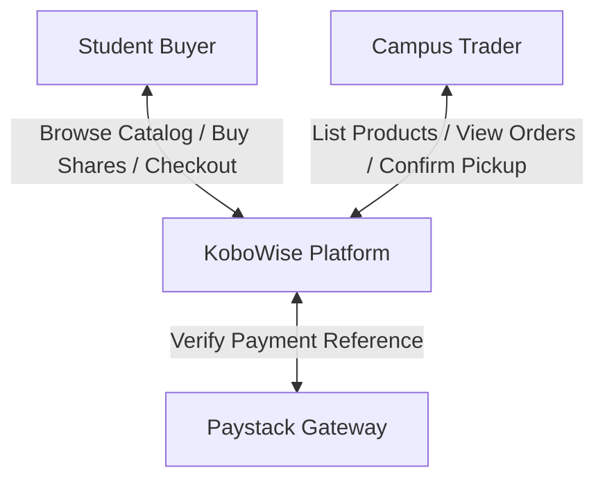
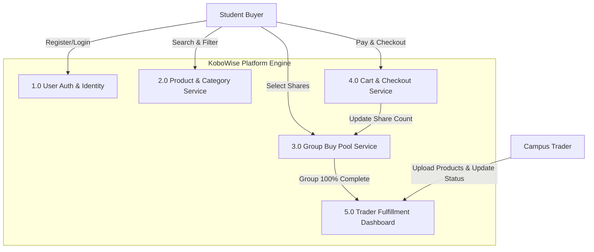
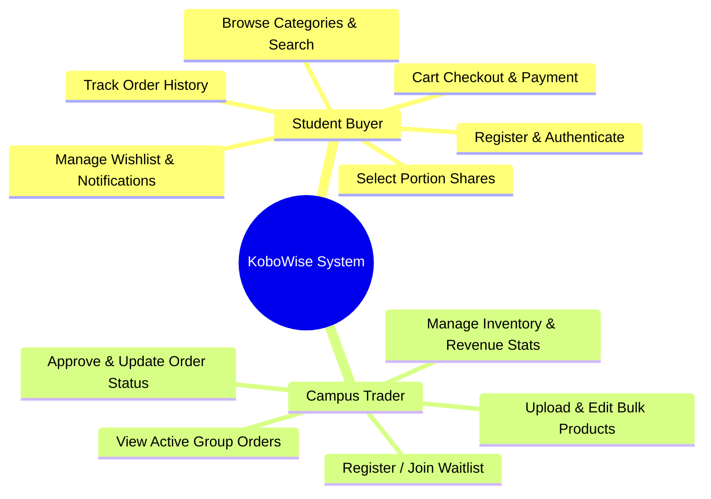
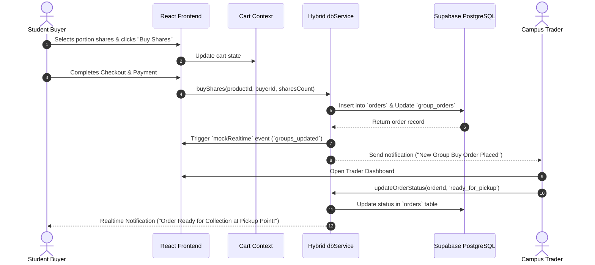
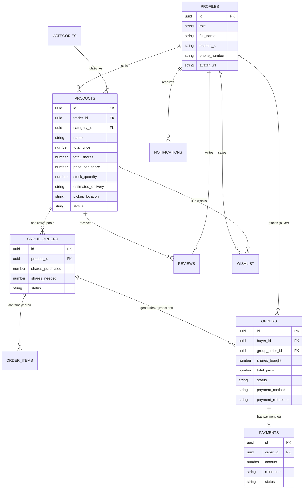

# KoboWise Platform — System Architecture & Technical Design Documentation

**Project Name**: KoboWise — Campus Bulk Group Buying & Wholesale Distribution System  
**Target Institution**: Delta State University (DELSU), Abraka  
**Repository**: [Kobowise](https://github.com/Snavetech/Kobowise)  
**Technology Stack**: React 18, Vite, TypeScript, Supabase (PostgreSQL Database, Auth, RLS), LocalStorage Hybrid Sync, Vanilla CSS  

---

## Table of Contents
1. [Development Methodology (Justified)](#1-development-methodology-justified)
2. [Existing System Analysis](#2-existing-system-analysis)
3. [Proposed System (KoboWise)](#3-proposed-system-kobowise)
4. [System Requirements](#4-system-requirements)
   - [4.1 Functional Requirements](#41-functional-requirements)
   - [4.2 Non-Functional Requirements](#42-non-functional-requirements)
5. [System Diagrams & Models](#5-system-diagrams--models)
   - [5.1 Data Flow Diagrams (DFD)](#51-data-flow-diagrams-dfd)
   - [5.2 UML Diagrams](#52-uml-diagrams)
6. [Database Design](#6-database-design)
   - [6.1 Entity Relationship Diagram (ERD)](#61-entity-relationship-diagram-erd)
   - [6.2 Complete PostgreSQL Database Schema (DDL)](#62-complete-postgresql-database-schema-ddl)
   - [6.3 Comprehensive Data Dictionary](#63-comprehensive-data-dictionary)
7. [System Architecture](#7-system-architecture)

---

## 1. Development Methodology (Justified)

### **Chosen Methodology: Agile Scrum Framework**

The development of the KoboWise platform follows an **Agile Scrum Methodology**, executed in 2-week iterative sprints.

```
┌─────────────────┐      ┌─────────────────┐      ┌─────────────────┐      ┌─────────────────┐
│ Sprint Planning │ ───> │ Rapid Prototype │ ───> │ Build & Hybrid  │ ───> │   Testing &     │ ───> ↺ Review &
│  & Backlog      │      │   & UI Tokens   │      │   Integration   │      │   Vercel CI/CD  │      Next Sprint
└─────────────────┘      └─────────────────┘      └─────────────────┘      └─────────────────┘
```

### **Justification:**
1. **Dynamic Campus Retail Requirements**: Student purchasing behaviors and merchant fulfillment workflows evolve based on academic calendars and inflation. Agile allows fast UI/UX iterations.
2. **Hybrid Storage Resilience**: Implementing dual-mode synchronization (local browser state + cloud Supabase PostgreSQL) required incremental module testing and validation.
3. **Continuous Deployment (CI/CD)**: Deploying incrementally to Vercel enabled continuous real-world testing of buyer-trader order approvals on mobile devices.

---

## 2. Existing System Analysis

### **Current Manual Approach**
Students at DELSU Abraka currently purchase food staples, laundry supplies, and toiletries through individual retail purchases at local markets (e.g., *Abraka Main Market*, *Site II Gate shops*). When students attempt informal group buying to split bulk items (e.g., 50kg bags of rice, cartons of noodles, vegetable oil drums), they organize manually via informal WhatsApp/Telegram group chats.

### **Drawbacks & Limitations of Existing Systems:**
- **High Unit Markup**: Individual retail purchases lack wholesale discount leverage, causing students to spend up to 45% more per unit.
- **Trust & Financial Risk**: Manual peer-to-peer bank transfers in group chats are vulnerable to payment fraud and unverified vendors.
- **Manual Calculation & Overhead**: Group admins spend hours calculating portion splits, verifying transfer screenshots, and resolving pickup location disputes.
- **No Trader Analytics**: Local campus vendors have no visibility into aggregate student demand before procuring inventory.

---

## 3. Proposed System (KoboWise)

KoboWise is an automated, web-based bulk group buying platform designed specifically for campus communities.

### **Key Innovations & Value Proposition:**
- **Automated Group Buy Pooling Engine**: Products are split into shares (portions). As buyers contribute, real-time progress bars update. Once 100% capacity is reached, the order completes automatically and alerts the vendor.
- **Hybrid Data Access Layer**: Works seamlessly online via Supabase Cloud PostgreSQL and falls back automatically to local storage persistence during network outages.
- **Campus Merchant Fulfillment Dashboard**: Allows verified campus traders to list bulk products, track completed groups, approve order fulfillment statuses (*processing*, *ready_for_pickup*, *delivered*, *refunded*), and view earnings.
- **Campus Logistics & Verification**: Built-in matriculation verification and Abraka-specific pickup location routing (*Site II Gate*, *Main Market*).

---

## 4. System Requirements

### 4.1 Functional Requirements

| ID | Module | Functional Description |
| :--- | :--- | :--- |
| **FR1** | **User Management** | Register and authenticate Student Buyers and Campus Traders with role-based routing and profile verification. |
| **FR2** | **Catalog & Search** | Browse product categories, search items, view unit share prices, and inspect group completion progress bars. |
| **FR3** | **Group Buy Pool Engine** | Select share counts, update active group buy slots, decrement stock, and auto-complete filled groups. |
| **FR4** | **Cart & Checkout** | Add multi-item portion shares to cart, compute totals, and complete transactions via Paystack or mock gateway. |
| **FR5** | **Trader Dashboard** | Create/edit bulk products, view incoming buyer orders, and update fulfillment states (*processing* → *ready_for_pickup* → *delivered*). |
| **FR6** | **Wishlist & Notifications** | Save favorite bulk items to wishlist and receive real-time notification alerts on order updates. |

### 4.2 Non-Functional Requirements

| ID | Quality Attribute | Technical Standard / Metric |
| :--- | :--- | :--- |
| **NFR1** | **Performance** | Initial page load under 1.8 seconds; local UI state updates under 50ms. |
| **NFR2** | **Availability** | 99.9% uptime via Vercel CDN; client-side `localStorage` fallback guarantees availability during cloud database downtime. |
| **NFR3** | **Security** | PostgreSQL Row Level Security (RLS) policies; input field sanitization; HTTPS encrypted transport. |
| **NFR4** | **Usability & Aesthetics** | Mobile-first responsive UI; dark/light modern typography; Lucide icons; zero broken images or placeholders. |
| **NFR5** | **Scalability** | Relational indexing and foreign key cascade constraints supporting thousands of concurrent student transactions. |

---

## 5. System Diagrams & Models

### 5.1 Data Flow Diagrams (DFD)

#### **DFD Level 0 (Context Diagram)**



#### **DFD Level 1 (System Decomposition)**



---

### 5.2 UML Diagrams

#### **Use Case Diagram**



#### **UML Sequence Diagram (Group Purchase & Fulfillment)**



---

## 6. Database Design

### 6.1 Entity Relationship Diagram (ERD)



---

### 6.2 Complete PostgreSQL Database Schema (DDL)

```sql
-- ============================================================================
-- KOBOWISE DATABASE SCHEMA (SUPABASE / POSTGRESQL)
-- ============================================================================

CREATE EXTENSION IF NOT EXISTS "uuid-ossp";

-- 1. PROFILES (Linked to Supabase Auth Users)
CREATE TABLE IF NOT EXISTS public.profiles (
    id UUID PRIMARY KEY REFERENCES auth.users(id) ON DELETE CASCADE,
    role TEXT NOT NULL CHECK (role IN ('buyer', 'trader')),
    full_name TEXT,
    student_id TEXT, -- Student Matric Number
    phone_number TEXT,
    avatar_url TEXT,
    created_at TIMESTAMPTZ NOT NULL DEFAULT NOW(),
    updated_at TIMESTAMPTZ NOT NULL DEFAULT NOW()
);

-- 2. CATEGORIES
CREATE TABLE IF NOT EXISTS public.categories (
    id UUID PRIMARY KEY DEFAULT gen_random_uuid(),
    name TEXT UNIQUE NOT NULL,
    slug TEXT UNIQUE NOT NULL,
    icon TEXT,
    created_at TIMESTAMPTZ NOT NULL DEFAULT NOW()
);

-- 3. PRODUCTS
CREATE TABLE IF NOT EXISTS public.products (
    id UUID PRIMARY KEY DEFAULT gen_random_uuid(),
    trader_id UUID NOT NULL REFERENCES public.profiles(id) ON DELETE CASCADE,
    category_id UUID REFERENCES public.categories(id) ON DELETE SET NULL,
    name TEXT NOT NULL,
    description TEXT,
    shares_per_person TEXT,
    total_price NUMERIC(12, 2) NOT NULL CHECK (total_price > 0),
    total_shares INTEGER NOT NULL CHECK (total_shares > 0),
    price_per_share NUMERIC(12, 2) NOT NULL CHECK (price_per_share > 0),
    stock_quantity INTEGER NOT NULL DEFAULT 1 CHECK (stock_quantity >= 0),
    estimated_delivery TEXT NOT NULL,
    pickup_location TEXT NOT NULL,
    status TEXT NOT NULL DEFAULT 'active' CHECK (status IN ('active', 'completed', 'cancelled')),
    created_at TIMESTAMPTZ NOT NULL DEFAULT NOW(),
    updated_at TIMESTAMPTZ NOT NULL DEFAULT NOW()
);

-- 4. GROUP ORDERS (Active group buy slots)
CREATE TABLE IF NOT EXISTS public.group_orders (
    id UUID PRIMARY KEY DEFAULT gen_random_uuid(),
    product_id UUID NOT NULL REFERENCES public.products(id) ON DELETE CASCADE,
    shares_purchased INTEGER NOT NULL DEFAULT 0,
    shares_needed INTEGER NOT NULL CHECK (shares_needed > 0),
    status TEXT NOT NULL DEFAULT 'pending' CHECK (status IN ('pending', 'completed', 'cancelled')),
    created_at TIMESTAMPTZ NOT NULL DEFAULT NOW(),
    updated_at TIMESTAMPTZ NOT NULL DEFAULT NOW(),
    CONSTRAINT shares_bounds CHECK (shares_purchased <= shares_needed)
);

-- 5. ORDER ITEMS
CREATE TABLE IF NOT EXISTS public.order_items (
    id UUID PRIMARY KEY DEFAULT gen_random_uuid(),
    group_order_id UUID NOT NULL REFERENCES public.group_orders(id) ON DELETE CASCADE,
    buyer_id UUID NOT NULL REFERENCES public.profiles(id) ON DELETE CASCADE,
    shares_bought INTEGER NOT NULL CHECK (shares_bought > 0),
    price_paid NUMERIC(12, 2) NOT NULL CHECK (price_paid >= 0),
    created_at TIMESTAMPTZ NOT NULL DEFAULT NOW()
);

-- 6. ORDERS (Final transactions and tracking)
CREATE TABLE IF NOT EXISTS public.orders (
    id UUID PRIMARY KEY DEFAULT gen_random_uuid(),
    buyer_id UUID NOT NULL REFERENCES public.profiles(id) ON DELETE CASCADE,
    group_order_id UUID NOT NULL REFERENCES public.group_orders(id) ON DELETE CASCADE,
    shares_bought INTEGER NOT NULL CHECK (shares_bought > 0),
    total_price NUMERIC(12, 2) NOT NULL CHECK (total_price >= 0),
    status TEXT NOT NULL DEFAULT 'processing' CHECK (status IN ('paid', 'processing', 'ready_for_pickup', 'delivered', 'cancelled', 'refund_requested', 'refunded')),
    payment_method TEXT NOT NULL,
    payment_reference TEXT UNIQUE,
    created_at TIMESTAMPTZ NOT NULL DEFAULT NOW(),
    updated_at TIMESTAMPTZ NOT NULL DEFAULT NOW()
);

-- 7. PAYMENTS
CREATE TABLE IF NOT EXISTS public.payments (
    id UUID PRIMARY KEY DEFAULT gen_random_uuid(),
    order_id UUID REFERENCES public.orders(id) ON DELETE CASCADE,
    amount NUMERIC(12, 2) NOT NULL CHECK (amount > 0),
    reference TEXT UNIQUE NOT NULL,
    status TEXT NOT NULL CHECK (status IN ('pending', 'success', 'failed')),
    created_at TIMESTAMPTZ NOT NULL DEFAULT NOW()
);

-- 8. REVIEWS
CREATE TABLE IF NOT EXISTS public.reviews (
    id UUID PRIMARY KEY DEFAULT gen_random_uuid(),
    product_id UUID NOT NULL REFERENCES public.products(id) ON DELETE CASCADE,
    buyer_id UUID NOT NULL REFERENCES public.profiles(id) ON DELETE CASCADE,
    rating INTEGER NOT NULL CHECK (rating >= 1 AND rating <= 5),
    comment TEXT,
    created_at TIMESTAMPTZ NOT NULL DEFAULT NOW(),
    UNIQUE(product_id, buyer_id)
);

-- 9. WISHLIST
CREATE TABLE IF NOT EXISTS public.wishlist (
    id UUID PRIMARY KEY DEFAULT gen_random_uuid(),
    product_id UUID NOT NULL REFERENCES public.products(id) ON DELETE CASCADE,
    buyer_id UUID NOT NULL REFERENCES public.profiles(id) ON DELETE CASCADE,
    created_at TIMESTAMPTZ NOT NULL DEFAULT NOW(),
    UNIQUE(product_id, buyer_id)
);

-- 10. NOTIFICATIONS
CREATE TABLE IF NOT EXISTS public.notifications (
    id UUID PRIMARY KEY DEFAULT gen_random_uuid(),
    user_id UUID NOT NULL REFERENCES public.profiles(id) ON DELETE CASCADE,
    title TEXT NOT NULL,
    message TEXT NOT NULL,
    is_read BOOLEAN NOT NULL DEFAULT FALSE,
    created_at TIMESTAMPTZ NOT NULL DEFAULT NOW()
);

-- ============================================================================
-- ROW-LEVEL SECURITY (RLS) POLICIES
-- ============================================================================

ALTER TABLE public.profiles ENABLE ROW LEVEL SECURITY;
ALTER TABLE public.categories ENABLE ROW LEVEL SECURITY;
ALTER TABLE public.products ENABLE ROW LEVEL SECURITY;
ALTER TABLE public.group_orders ENABLE ROW LEVEL SECURITY;
ALTER TABLE public.order_items ENABLE ROW LEVEL SECURITY;
ALTER TABLE public.orders ENABLE ROW LEVEL SECURITY;
ALTER TABLE public.payments ENABLE ROW LEVEL SECURITY;
ALTER TABLE public.reviews ENABLE ROW LEVEL SECURITY;
ALTER TABLE public.wishlist ENABLE ROW LEVEL SECURITY;
ALTER TABLE public.notifications ENABLE ROW LEVEL SECURITY;

-- Public read access policies
CREATE POLICY "Public profiles are viewable by everyone" ON public.profiles FOR SELECT USING (true);
CREATE POLICY "Categories are viewable by everyone" ON public.categories FOR SELECT USING (true);
CREATE POLICY "Products are viewable by everyone" ON public.products FOR SELECT USING (true);
CREATE POLICY "Group orders are viewable by everyone" ON public.group_orders FOR SELECT USING (true);
CREATE POLICY "Order items are viewable by everyone" ON public.order_items FOR SELECT USING (true);
CREATE POLICY "Orders are viewable by everyone" ON public.orders FOR SELECT USING (true);
CREATE POLICY "Payments are viewable by everyone" ON public.payments FOR SELECT USING (true);
CREATE POLICY "Reviews are viewable by everyone" ON public.reviews FOR SELECT USING (true);

-- Write policies
CREATE POLICY "Anyone can insert orders" ON public.orders FOR INSERT WITH CHECK (true);
CREATE POLICY "Anyone can update orders" ON public.orders FOR UPDATE USING (true);
CREATE POLICY "Anyone can add order items" ON public.order_items FOR INSERT WITH CHECK (true);
CREATE POLICY "Anyone can insert payments" ON public.payments FOR INSERT WITH CHECK (true);
```

---

### 6.3 Comprehensive Data Dictionary

#### **Table 1: `profiles`**
| Field Name | Data Type | Nullable | Key | Default | Description |
| :--- | :--- | :--- | :--- | :--- | :--- |
| `id` | `UUID` | No | PK | None | References `auth.users(id)`. |
| `role` | `TEXT` | No | None | None | User role: `'buyer'` or `'trader'`. |
| `full_name` | `TEXT` | Yes | None | `NULL` | User's full name. |
| `student_id` | `TEXT` | Yes | None | `NULL` | Student matriculation number. |
| `phone_number` | `TEXT` | Yes | None | `NULL` | Contact phone number. |
| `avatar_url` | `TEXT` | Yes | None | `NULL` | Profile picture URL. |
| `created_at` | `TIMESTAMPTZ` | No | None | `NOW()` | Profile creation timestamp. |

#### **Table 2: `products`**
| Field Name | Data Type | Nullable | Key | Default | Description |
| :--- | :--- | :--- | :--- | :--- | :--- |
| `id` | `UUID` | No | PK | `gen_random_uuid()` | Unique product identifier. |
| `trader_id` | `UUID` | No | FK | None | References `profiles.id` of trader. |
| `category_id` | `UUID` | Yes | FK | `NULL` | References `categories.id`. |
| `name` | `TEXT` | No | None | None | Product name (e.g. *Royal Stallion Rice 50kg*). |
| `description` | `TEXT` | Yes | None | `NULL` | Detailed product specifications. |
| `shares_per_person` | `TEXT` | Yes | None | `NULL` | Portion description (e.g. *12.5kg per share*). |
| `total_price` | `NUMERIC(12,2)`| No | None | None | Whole bulk price (₦). |
| `total_shares` | `INTEGER` | No | None | None | Total portions per bulk product. |
| `price_per_share` | `NUMERIC(12,2)`| No | None | None | Cost per individual share (₦). |
| `stock_quantity` | `INTEGER` | No | None | `1` | Total inventory units available. |
| `estimated_delivery`| `TEXT` | No | None | None | Delivery estimate (e.g. *Same Day Delivery*). |
| `pickup_location` | `TEXT` | No | None | None | Pickup location (e.g. *Site II Gate Shop 1B*). |
| `status` | `TEXT` | No | None | `'active'` | Status: `'active'`, `'completed'`, `'cancelled'`. |

#### **Table 3: `orders`**
| Field Name | Data Type | Nullable | Key | Default | Description |
| :--- | :--- | :--- | :--- | :--- | :--- |
| `id` | `UUID` | No | PK | `gen_random_uuid()` | Unique transaction order key. |
| `buyer_id` | `UUID` | No | FK | None | References `profiles.id` of buyer. |
| `group_order_id` | `UUID` | No | FK | None | References `group_orders.id`. |
| `shares_bought` | `INTEGER` | No | None | None | Shares purchased in transaction. |
| `total_price` | `NUMERIC(12,2)`| No | None | None | Total amount paid (₦). |
| `status` | `TEXT` | No | None | `'processing'` | Status: `paid`, `processing`, `ready_for_pickup`, `delivered`, `cancelled`, `refund_requested`, `refunded`. |
| `payment_method` | `TEXT` | No | None | None | Payment type (e.g. *Paystack*, *Mock Wallet*). |
| `payment_reference`| `TEXT` | No | UK | None | Unique reference code (e.g. *KBW8392017465*). |

---

## 7. System Architecture of KoboWise

KoboWise is built following a **4-Tier Layered Architecture** with Client-Side Hybrid Storage Redundancy.

```
┌─────────────────────────────────────────────────────────────────────────────┐
│                          PRESENTATION TIER (UI/UX)                          │
│     React 18 + TypeScript + Vite + Lucide Icons + Responsive CSS Tokens    │
└─────────────────────────────────────────────────────────────────────────────┘
                                       │
                                       ▼
┌─────────────────────────────────────────────────────────────────────────────┐
│                      STATE & ROUTING LAYER (CONTEXT)                        │
│   HashRouter + AuthContext + CartContext + MockRealtime PubSub Event Bus    │
└─────────────────────────────────────────────────────────────────────────────┘
                                       │
                                       ▼
┌─────────────────────────────────────────────────────────────────────────────┐
│                    HYBRID DATA ACCESS LAYER (dbService)                     │
│    Reads & Writes to Supabase Database with LocalStorage Fallback Sync      │
└─────────────────────────────────────────────────────────────────────────────┘
                                       │
                  ┌────────────────────┴────────────────────┐
                  ▼                                         ▼
┌───────────────────────────────────┐     ┌───────────────────────────────────┐
│     SUPABASE CLOUD BACKEND        │     │    BROWSER LOCAL STORAGE BACKUP   │
│  PostgreSQL Database + Auth + RLS │     │  Indexed Collections & Session    │
└───────────────────────────────────┘     └───────────────────────────────────┘
```

### Component Architecture Breakdown:
1. **Presentation Tier**: Built with React 18, TypeScript, and Vite. Responsive layouts for mobile and desktop screens.
2. **State & Routing Layer**:
   - `AuthContext`: Identity, user role routing (`buyer` / `trader`), session persistence.
   - `CartContext`: Cart item calculations, portion multipliers, total price aggregation.
   - `mockRealtime`: Event bus notifying components of active group buy completion and order status updates.
3. **Hybrid Data Access Layer (`dbService` in `src/supabase.ts`)**:
   - Executes live cloud queries via `@supabase/supabase-js`.
   - Merges live records with `localStorage` fallback storage, guaranteeing data accessibility across logins and network states.
4. **Database & Hosting Infrastructure**:
   - **Supabase Cloud**: Production PostgreSQL database with RLS policies.
   - **Vercel CDN**: Global edge deployment with continuous integration from GitHub (`main` branch).
